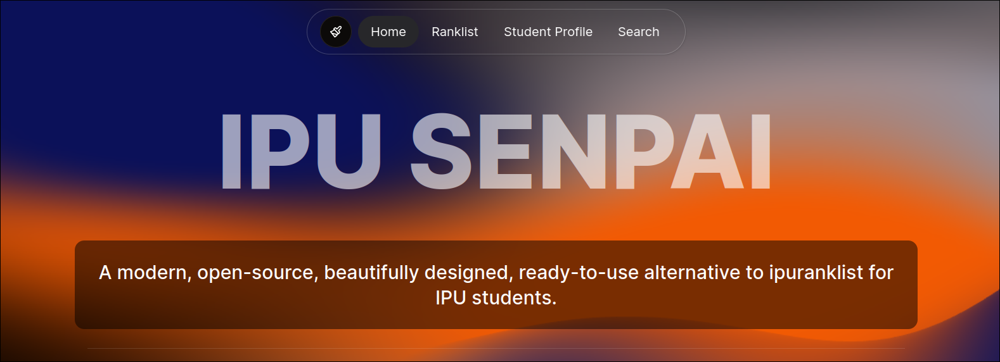
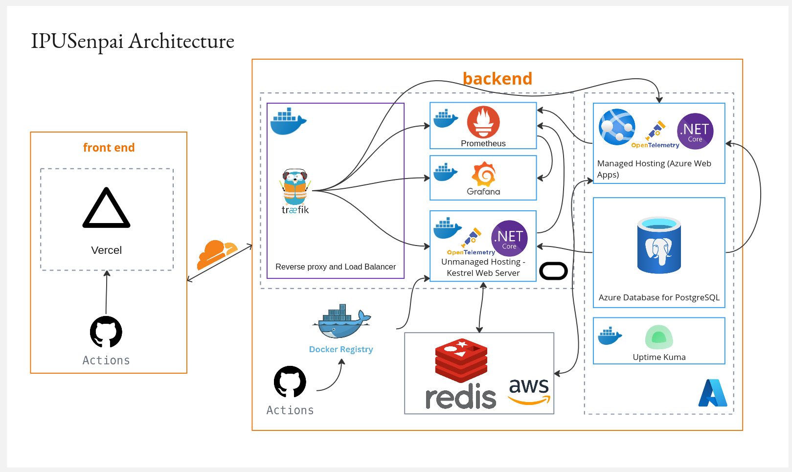
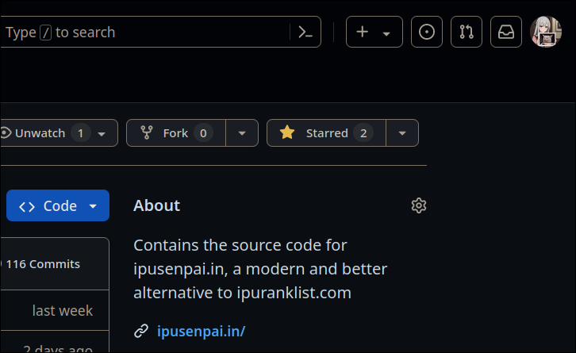

<!-- Author: Vedant Arya (martian0x80) -->
<!-- Last Modified: 2024-05-18 -->

<h1 style="border-bottom: none">
    <b><a href="https://www.ipusenpai.in/">IPU Senpai</a></b>
     
</h1>

 
 

  A modern, open-source, beautifully designed, ready-to-use alternative to ipuranklist for IPU students. Built with Next.js, Tailwind CSS, and TypeScript.

 

    <a href="https://www.ipusenpai.in/">Home Page</a> |
    <a href="">Discord</a> |
    <a href="mailto:ipusenpai0x80@gmail.com">Mail</a> |
    <a href="https://github.com/martian0x80/IPUSenpaiBackend/">Backend Repository</a>

 

    

        Architecture
    

## Getting started & staying tuned with us.

Star us, and you will receive all release notifications from GitHub without any delay!

## Features

- **Modern UI**: A clean, modern, and responsive UI that looks great on all devices.
- **Easy to Use**: A simple and intuitive interface that makes it easy to find your results.
- **Open Source**: Built with open-source technologies and available for free on GitHub.
- **Fast**: Built with performance in mind, so you can get your results quickly. Uses Next.js for server-side rendering. Redis for caching and PostgreSQL for database.
- **Robust**: Built with Next.js, Tailwind CSS, and TypeScript, so you can trust that it's reliable. Tested with 1200+ result PDFs. The parser is one-of-a-kind and can parse most result PDFs.

## Contributing

We welcome contributions from everyone. Follow the steps in the [CONTRIBUTING.md](CONTRIBUTING.md) file to get started.
